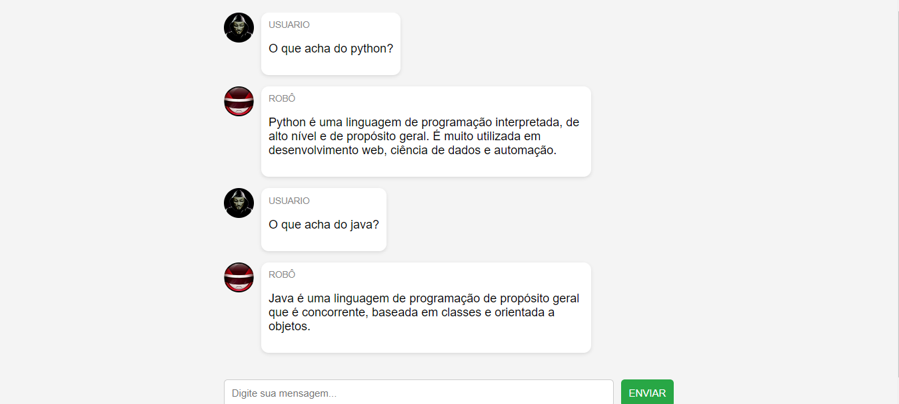

# CHATBOT DE PROGRAMACAO
👨‍🏫CHATBOT SIMPLES QUE USA O CDN DO JQUERY.

  

## DESCRIÇÃO:
Esse é um chatbot simples que responde a perguntas relacionadas a tecnologias de programação usando JavaScript (JS).

Este bot serve como uma introdução prática ao desenvolvimento de chatbots usando JavaScript no contexto web, oferecendo uma base sólida para explorações adicionais e melhorias conforme necessário.

## FUNCIONALIDADES:
1. **Respostas Inteligentes**: O bot responde a perguntas sobre diferentes tecnologias de programação, como HTML, CSS, JavaScript, Python, Java, React, Node.js, entre outras.

2. **Interação Simples**: Ele permite ao usuário digitar uma mensagem e envia-la. Após um breve intervalo (simulado por `setTimeout`), o bot responde automaticamente com uma mensagem relacionada à entrada do usuário.

3. **Interface Visual**: Utiliza HTML e CSS para criar uma interface de chat simples e intuitiva, mostrando as mensagens dos usuários e do bot.

4. **Script de Respostas Separado**: As respostas do bot são definidas no arquivo `RESPOSTAS.js`, o que facilita a manutenção e a expansão das funcionalidades de resposta.

## EXECUTANDO O PROJETO:
1. **Inicialização**:
   - Abra o arquivo `./CODIGO/CODIGO.html` no navegador de sua preferencia.

2. **Envio de Mensagem**:
   - Digite uma mensagem no campo de entrada e clica no botão "ENVIAR".
   - O bot responderá automaticamente com uma mensagem sobre os tópicos relacionados a programação.
   - Continue a conversa digitando novas mensagens e recebendo respostas automáticas do bot.

3. **Processamento**:
   - A mensagem do usuário é exibida no chat como "USUARIO".
   - O bot processa a mensagem após um breve intervalo e envia uma resposta como "ROBÔ".

4. **Respostas do Bot**:
   - As respostas do bot são baseadas nas palavras-chave contidas na mensagem do usuário. Se a mensagem do usuário contém uma palavra-chave listada em `RESPOSTAS.js`, o bot responde com a mensagem correspondente.
   - Se não houver correspondência com nenhuma palavra-chave definida, o bot envia uma resposta padrão.

5. **Interface Visual**:
   - Cada mensagem é exibida em um balão de chat, mostrando o nome do remetente (USUARIO ou ROBÔ) e o conteúdo da mensagem.
   - As mensagens são organizadas verticalmente com um efeito de rolagem automática para manter a visibilidade da conversa mais recente.

## NÃO SABE?
- Entendemos que para manipular arquivos em `HTML`, `CSS` e outras linguagens relacionadas, é necessário possuir conhecimento nessas áreas. Para auxiliar nesse aprendizado, oferecemos cursos gratuitos disponíveis:
* [CURSO DE HTML E CSS](https://github.com/VILHALVA/CURSO-DE-HTML-E-CSS)
* [CURSO DE JAVASCRIPT](https://github.com/VILHALVA/CURSO-DE-JAVASCRIPT)
* [CURSO DE JQUERY](https://github.com/VILHALVA/CURSO-DE-JQUERY)
* [CONFIRA MAIS CURSOS](https://github.com/VILHALVA?tab=repositories&q=+topic:CURSO)

## CREDITOS:
- [PROJETO CRIADO PELO VILHALVA](https://github.com/VILHALVA)
